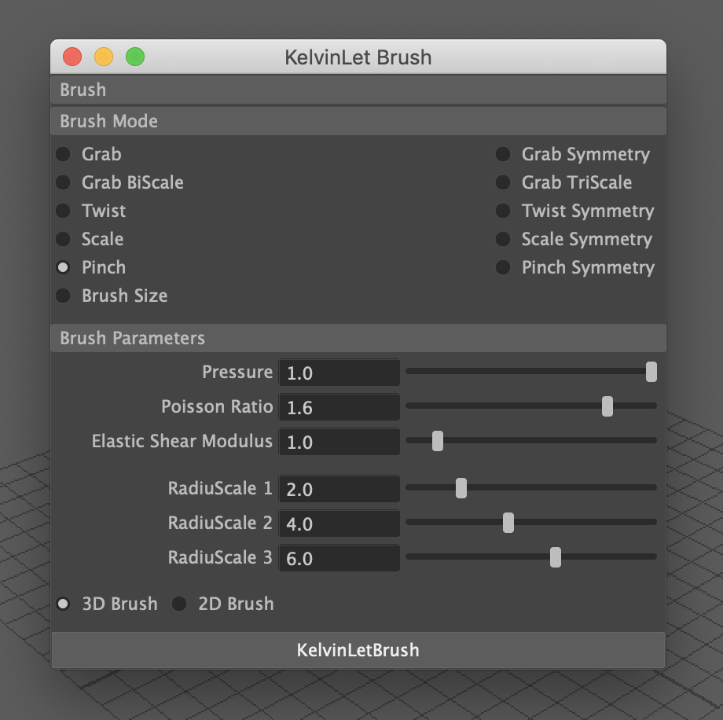

# Kelvinlets-Brush

- A Maya Plug-in based on C++ for *Regularized Kelvinlets: Sculpting Brushes based on Fundamental Solutions of Elasticity (SIGGRAPH 2017)*

- Author: Yuanqing Zhang, Jinkun Zhang, Chulin Xie.

