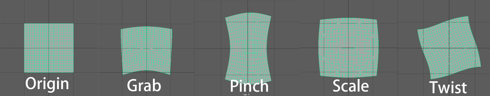
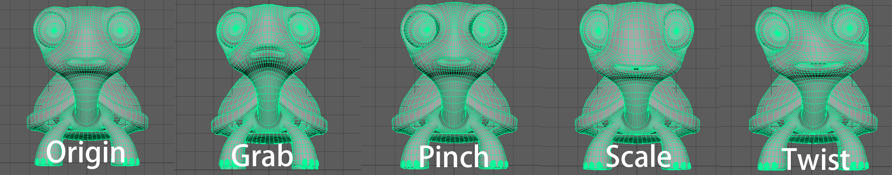

# Kelvinlets-Brush

- A Maya Plug-in in C++ for *Regularized Kelvinlets: Sculpting Brushes based on Fundamental Solutions of Elasticity (SIGGRAPH 2017)*

- Author: Yuanqing Zhang, Jinkun Zhang, Chulin Xie.

- 2D 

- 3D 

- UI
  <figure>
    
  </figure>
